# SunStay Database Documentation

## 1. Purpose

This document defines the database structure for **SunStay**, a hotel management system for internal use at **Hotel Tropical Sun**.

The database must support the operational and administrative processes of the hotel, including:

- reservations
- reservation holders
- guests
- rooms
- stays
- billing and payments
- inventory by hotel area
- staff management
- staff attendance and access control
- common area reservations
- users and roles
- reports and operational traceability

The database model must prioritize:

- relational integrity
- normalization
- traceability
- clear business relationships
- reporting capability
- maintainability
- future scalability

---

## 2. Selected Database Technology

The selected database engine for SunStay is **PostgreSQL**.

PostgreSQL is used as the main transactional database because the hotel domain requires structured and relational data between reservations, guests, rooms, invoices, inventory, staff, attendance, common areas, and reports.

The selected ORM is **Prisma ORM**, used from the **NestJS** backend with **TypeScript**.

### Technology decisions

| Component | Selected Technology |
|---|---|
| Database engine | PostgreSQL |
| ORM | Prisma ORM |
| Backend integration | NestJS + TypeScript |
| API style | REST |
| Local development | Docker Compose |
| Cloud database target | Azure Database for PostgreSQL |

---

## 3. Database Design Principles

The SunStay database must follow these principles:

1. Use a relational data model.
2. Use primary keys for every table.
3. Use foreign keys for all business relationships.
4. Normalize repeated values into catalog tables.
5. Use history tables when operational traceability is required.
6. Avoid storing calculated values unless they are required as historical snapshots.
7. Keep operational data separated from configuration/catalog data.
8. Use consistent naming conventions.
9. Avoid duplicated fields when a relationship table is more appropriate.
10. Preserve data consistency across reservations, rooms, guests, billing, inventory, staff, and reports.

---

## 4. Naming Conventions

### Table names

Use descriptive and consistent names. In Prisma, models should use PascalCase. Database table names may use snake_case through mapping if required.

Examples:

```txt
Reservation
ReservationGuest
Room
RoomType
Invoice
InventoryMovement
StaffAttendance
```

### Primary keys

Use the following format:

```txt
id
```

or, if using explicit database column names:

```txt
id_reservation
id_guest
id_room
```

### Foreign keys

Use descriptive relation fields:

```txt
hotelId
reservationId
guestId
roomId
staffId
userId
```

### Timestamps

Recommended timestamp fields:

```txt
createdAt
updatedAt
deletedAt
```

Use `deletedAt` only if soft deletion is required.

---

## 5. Main Database Modules

The database is organized into the following business modules:

1. Hotel and rooms
2. Reservations and guests
3. Stays
4. Billing and payments
5. Inventory by area
6. Staff and attendance
7. Users and roles
8. Common areas
9. Reports
10. Audit and traceability

---

## 6. Entity List

### 6.1 Hotel and rooms

| Entity | Purpose |
|---|---|
| Hotel | Stores general hotel information. |
| RoomType | Defines room categories, capacity, and base rate. |
| RoomStatus | Catalog of possible room states. |
| Room | Stores hotel room information. |
| RoomStatusHistory | Tracks room status changes over time. |

### 6.2 Reservations and guests

| Entity | Purpose |
|---|---|
| ReservationHolder | Stores the responsible person who creates the reservation. |
| Guest | Stores guest information. |
| ReservationStatus | Catalog of reservation states. |
| Reservation | Stores reservation header information. |
| ReservationGuest | Links multiple guests to one reservation. |
| ReservationDetail | Links reservations to one or more rooms. |
| ReservationStatusHistory | Tracks reservation status changes. |

### 6.3 Stays

| Entity | Purpose |
|---|---|
| Stay | Stores check-in and check-out information related to a reservation. |

### 6.4 Billing and payments

| Entity | Purpose |
|---|---|
| PaymentStatus | Catalog of invoice payment states. |
| PaymentMethod | Catalog of payment methods. |
| Invoice | Stores invoice header information. |
| InvoiceDetail | Stores invoice line items. |

### 6.5 Inventory by area

| Entity | Purpose |
|---|---|
| InventoryArea | Defines hotel areas where inventory is controlled. |
| ProductCategory | Catalog of product categories. |
| Product | Stores products and supplies. |
| Inventory | Stores current stock by area and product. |
| InventoryMovement | Tracks stock entries and exits. |

### 6.6 Staff and attendance

| Entity | Purpose |
|---|---|
| Position | Catalog of staff positions. |
| Shift | Defines staff work shifts. |
| Staff | Stores staff member information. |
| StaffAttendance | Tracks daily attendance. |
| StaffAccessControl | Tracks detailed check-in and check-out movements. |

### 6.7 Users and roles

| Entity | Purpose |
|---|---|
| Role | Catalog of system roles. |
| User | Stores internal system users. |

### 6.8 Common areas

| Entity | Purpose |
|---|---|
| CommonArea | Stores hotel common areas such as pool and meeting room. |
| CommonAreaReservation | Stores reservations for common areas. |

### 6.9 Reports

| Entity | Purpose |
|---|---|
| ReportType | Catalog of report types. |
| Report | Stores report generation metadata. |
| ReportDetail | Stores report detail or summarized result data if required. |

---

## 7. Entity Definitions

## 7.1 Hotel

Stores general information about Hotel Tropical Sun.

| Field | Type | Description |
|---|---|---|
| id | UUID / Int | Primary key. |
| name | String | Hotel name. |
| address | String | Hotel address. |
| phone | String | Contact phone. |
| email | String | Contact email. |
| createdAt | DateTime | Creation date. |
| updatedAt | DateTime | Last update date. |

Relationships:

- One hotel has many rooms.
- One hotel has many reservations.
- One hotel has many staff members.
- One hotel has many inventory areas.
- One hotel has many common areas.

---

## 7.2 RoomType

Defines the type, capacity, and base rate of a room.

| Field | Type | Description |
|---|---|---|
| id | UUID / Int | Primary key. |
| name | String | Room type name. |
| description | String | Room type description. |
| capacity | Int | Maximum guest capacity. |
| baseRate | Decimal | Base price per night. |
| createdAt | DateTime | Creation date. |
| updatedAt | DateTime | Last update date. |

Relationships:

- One room type classifies many rooms.

---

## 7.3 RoomStatus

Catalog of room states.

Recommended values:

- Available
- Occupied
- Reserved
- Cleaning
- Maintenance

| Field | Type | Description |
|---|---|---|
| id | UUID / Int | Primary key. |
| name | String | Status name. |
| description | String | Status description. |

Relationships:

- One room status can be assigned to many rooms.
- One room status can appear in many room status history records.

---

## 7.4 Room

Stores room data.

| Field | Type | Description |
|---|---|---|
| id | UUID / Int | Primary key. |
| hotelId | FK | Related hotel. |
| roomTypeId | FK | Related room type. |
| roomStatusId | FK | Current room status. |
| number | String | Room number. |
| floor | String / Int | Floor where the room is located. |
| observation | String | Optional room notes. |
| createdAt | DateTime | Creation date. |
| updatedAt | DateTime | Last update date. |

Relationships:

- One hotel has many rooms.
- One room belongs to one room type.
- One room has one current status.
- One room can appear in many reservation details.
- One room has many status history records.

---

## 7.5 RoomStatusHistory

Tracks changes in room state over time.

| Field | Type | Description |
|---|---|---|
| id | UUID / Int | Primary key. |
| roomId | FK | Related room. |
| roomStatusId | FK | Assigned status. |
| startDateTime | DateTime | Start of the status period. |
| endDateTime | DateTime | End of the status period. |
| observation | String | Optional notes. |

Relationships:

- One room has many status history records.
- One room status can be used in many history records.

---

## 7.6 ReservationHolder

Stores the responsible person who creates or owns the reservation.

This entity is separated from Guest because the person responsible for a reservation may not always be the only guest staying in the hotel.

| Field | Type | Description |
|---|---|---|
| id | UUID / Int | Primary key. |
| firstName | String | Holder first name. |
| lastName | String | Holder last name. |
| identityDocument | String | Document number. |
| phone | String | Contact phone. |
| email | String | Contact email. |
| createdAt | DateTime | Creation date. |
| updatedAt | DateTime | Last update date. |

Relationships:

- One reservation holder can create many reservations.

---

## 7.7 Guest

Stores guest information.

| Field | Type | Description |
|---|---|---|
| id | UUID / Int | Primary key. |
| firstName | String | Guest first name. |
| lastName | String | Guest last name. |
| identityDocument | String | Guest identity document. |
| phone | String | Contact phone. |
| email | String | Contact email. |
| nationality | String | Guest nationality. |
| createdAt | DateTime | Creation date. |
| updatedAt | DateTime | Last update date. |

Relationships:

- One guest can be linked to many reservations through ReservationGuest.
- One guest can request many common area reservations.

---

## 7.8 ReservationStatus

Catalog of reservation states.

Recommended values:

- Pending
- Confirmed
- Cancelled
- Checked-in
- Checked-out

| Field | Type | Description |
|---|---|---|
| id | UUID / Int | Primary key. |
| name | String | Status name. |
| description | String | Status description. |

Relationships:

- One reservation status can be assigned to many reservations.
- One reservation status can appear in many reservation history records.

---

## 7.9 Reservation

Stores reservation header information.

| Field | Type | Description |
|---|---|---|
| id | UUID / Int | Primary key. |
| hotelId | FK | Related hotel. |
| reservationHolderId | FK | Responsible reservation holder. |
| reservationStatusId | FK | Current reservation status. |
| reservationDate | Date | Date when reservation was created. |
| checkInDate | Date | Planned check-in date. |
| checkOutDate | Date | Planned check-out date. |
| guestQuantity | Int | Total number of guests. |
| reservationChannel | String | Channel used to create the reservation. |
| estimatedAmount | Decimal | Estimated reservation amount. |
| observation | String | Optional reservation notes. |
| createdAt | DateTime | Creation date. |
| updatedAt | DateTime | Last update date. |

Relationships:

- One hotel has many reservations.
- One reservation holder can create many reservations.
- One reservation has one current status.
- One reservation has many associated guests through ReservationGuest.
- One reservation has many reservation details.
- One reservation can generate one stay.
- One reservation can generate one invoice.
- One reservation has many status history records.

Business rules:

- A reservation must have one responsible holder.
- A reservation can include one or more guests.
- A reservation can include one or more rooms.
- Guest quantity must not exceed the total capacity of assigned rooms.

---

## 7.10 ReservationGuest

Intermediate entity that links reservations and guests.

| Field | Type | Description |
|---|---|---|
| id | UUID / Int | Primary key. |
| reservationId | FK | Related reservation. |
| guestId | FK | Related guest. |
| isMainGuest | Boolean | Indicates whether the guest is the main guest. |
| observation | String | Optional notes. |

Relationships:

- One reservation can include many guests.
- One guest can participate in many reservations.

---

## 7.11 ReservationDetail

Links reservations with assigned rooms.

| Field | Type | Description |
|---|---|---|
| id | UUID / Int | Primary key. |
| reservationId | FK | Related reservation. |
| roomId | FK | Assigned room. |
| appliedRate | Decimal | Applied nightly rate. |
| nightsQuantity | Int | Number of nights. |
| subtotal | Decimal | Detail subtotal. |

Relationships:

- One reservation has many reservation details.
- One room can appear in many reservation details over time.

---

## 7.12 ReservationStatusHistory

Tracks reservation status changes.

| Field | Type | Description |
|---|---|---|
| id | UUID / Int | Primary key. |
| reservationId | FK | Related reservation. |
| reservationStatusId | FK | New status. |
| userId | FK | User who made the change. |
| changeDateTime | DateTime | Date and time of the change. |
| observation | String | Optional notes. |

Relationships:

- One reservation has many history records.
- One user can perform many reservation status changes.
- One reservation status can appear in many history records.

---

## 7.13 Stay

Stores check-in and check-out information.

| Field | Type | Description |
|---|---|---|
| id | UUID / Int | Primary key. |
| reservationId | FK | Related reservation. |
| checkInDateTime | DateTime | Actual check-in date and time. |
| checkOutDateTime | DateTime | Actual check-out date and time. |
| stayStatus | String | Current stay status. |
| observation | String | Optional stay notes. |

Relationships:

- One reservation can generate zero or one stay.

---

## 7.14 PaymentStatus

Catalog of invoice payment states.

Recommended values:

- Pending
- Partial
- Paid
- Overdue

| Field | Type | Description |
|---|---|---|
| id | UUID / Int | Primary key. |
| name | String | Status name. |
| description | String | Status description. |

Relationships:

- One payment status can be assigned to many invoices.

---

## 7.15 PaymentMethod

Catalog of accepted payment methods.

Recommended values:

- Cash
- Bank Transfer
- Card
- QR Payment

| Field | Type | Description |
|---|---|---|
| id | UUID / Int | Primary key. |
| name | String | Payment method name. |
| description | String | Payment method description. |

Relationships:

- One payment method can be used in many invoices.

---

## 7.16 Invoice

Stores invoice header data.

| Field | Type | Description |
|---|---|---|
| id | UUID / Int | Primary key. |
| reservationId | FK | Related reservation. |
| paymentStatusId | FK | Current payment status. |
| paymentMethodId | FK | Payment method. |
| issueDate | Date | Invoice issue date. |
| total | Decimal | Invoice total amount. |
| createdAt | DateTime | Creation date. |
| updatedAt | DateTime | Last update date. |

Relationships:

- One reservation can originate zero or one invoice.
- One invoice contains many invoice details.
- One invoice has one payment status.
- One invoice uses one payment method.

---

## 7.17 InvoiceDetail

Stores invoice line items.

| Field | Type | Description |
|---|---|---|
| id | UUID / Int | Primary key. |
| invoiceId | FK | Related invoice. |
| concept | String | Billing concept. |
| quantity | Int | Item quantity. |
| unitPrice | Decimal | Unit price. |
| subtotal | Decimal | Detail subtotal. |

Relationships:

- One invoice has many invoice details.

---

## 7.18 Position

Catalog of staff positions.

Recommended values:

- Receptionist
- Administrator
- Cleaning Staff
- Maintenance Staff
- Manager
- Inventory Manager

| Field | Type | Description |
|---|---|---|
| id | UUID / Int | Primary key. |
| name | String | Position name. |
| description | String | Position description. |

Relationships:

- One position can classify many staff members.

---

## 7.19 Shift

Defines work shifts.

| Field | Type | Description |
|---|---|---|
| id | UUID / Int | Primary key. |
| name | String | Shift name. |
| startTime | Time | Shift start time. |
| endTime | Time | Shift end time. |
| description | String | Shift description. |

Relationships:

- One shift can be assigned to many staff members.

---

## 7.20 Staff

Stores staff member information.

| Field | Type | Description |
|---|---|---|
| id | UUID / Int | Primary key. |
| hotelId | FK | Related hotel. |
| positionId | FK | Staff position. |
| shiftId | FK | Assigned shift. |
| firstName | String | Staff first name. |
| lastName | String | Staff last name. |
| phone | String | Contact phone. |
| email | String | Contact email. |
| status | String | Staff status. |
| createdAt | DateTime | Creation date. |
| updatedAt | DateTime | Last update date. |

Relationships:

- One hotel employs many staff members.
- One staff member belongs to one position.
- One staff member belongs to one shift.
- One staff member can have many attendance records.
- One staff member can have many access control records.
- One staff member can register many inventory movements.
- One staff member can have zero or one system user.

---

## 7.21 StaffAttendance

Tracks daily staff attendance.

| Field | Type | Description |
|---|---|---|
| id | UUID / Int | Primary key. |
| staffId | FK | Related staff member. |
| date | Date | Attendance date. |
| entryTime | Time | Daily entry time. |
| exitTime | Time | Daily exit time. |
| attendanceStatus | String | Attendance state. |
| observation | String | Optional notes. |

Recommended attendance states:

- Present
- Absent
- Late
- Permission
- Completed

Relationships:

- One staff member has many attendance records.

---

## 7.22 StaffAccessControl

Tracks detailed staff access movements.

| Field | Type | Description |
|---|---|---|
| id | UUID / Int | Primary key. |
| staffId | FK | Related staff member. |
| dateTime | DateTime | Movement date and time. |
| movementType | String | Entry or exit. |
| recordSource | String | Manual or system source. |
| observation | String | Optional notes. |

Relationships:

- One staff member has many access control records.

---

## 7.23 Role

Catalog of internal system roles.

Required roles:

- Receptionist
- Administrator
- Inventory Manager
- Management

| Field | Type | Description |
|---|---|---|
| id | UUID / Int | Primary key. |
| name | String | Role name. |
| description | String | Role description. |

Relationships:

- One role can be assigned to many users.

---

## 7.24 User

Stores internal system users.

| Field | Type | Description |
|---|---|---|
| id | UUID / Int | Primary key. |
| staffId | FK | Related staff member. |
| roleId | FK | Assigned role. |
| username | String | Login username. |
| passwordHash | String | Hashed password. |
| status | String | User status. |
| lastAccessAt | DateTime | Last login date and time. |
| createdAt | DateTime | Creation date. |
| updatedAt | DateTime | Last update date. |

Relationships:

- One staff member can have zero or one user account.
- One role can be assigned to many users.
- One user can generate many reports.
- One user can perform many reservation status changes.

Security rules:

- Passwords must never be stored in plain text.
- Users must be linked to internal staff.
- Access must be controlled by role.

---

## 7.25 InventoryArea

Defines hotel areas where inventory is controlled.

Recommended values:

- Breakfast
- Pool
- Room Supplies
- Cleaning Products

| Field | Type | Description |
|---|---|---|
| id | UUID / Int | Primary key. |
| hotelId | FK | Related hotel. |
| name | String | Area name. |
| description | String | Area description. |

Relationships:

- One hotel organizes many inventory areas.
- One inventory area contains many inventory records.

---

## 7.26 ProductCategory

Catalog of product categories.

| Field | Type | Description |
|---|---|---|
| id | UUID / Int | Primary key. |
| name | String | Category name. |
| description | String | Category description. |

Relationships:

- One product category classifies many products.

---

## 7.27 Product

Stores product or supply information.

| Field | Type | Description |
|---|---|---|
| id | UUID / Int | Primary key. |
| productCategoryId | FK | Related category. |
| name | String | Product name. |
| description | String | Product description. |
| unitOfMeasure | String | Unit of measure. |
| minimumStock | Decimal | Minimum stock threshold. |
| createdAt | DateTime | Creation date. |
| updatedAt | DateTime | Last update date. |

Relationships:

- One product belongs to one category.
- One product can appear in many inventory records.

---

## 7.28 Inventory

Stores current stock by area and product.

| Field | Type | Description |
|---|---|---|
| id | UUID / Int | Primary key. |
| inventoryAreaId | FK | Related inventory area. |
| productId | FK | Related product. |
| currentStock | Decimal | Current stock amount. |
| updatedAt | DateTime | Last update date. |

Relationships:

- One inventory area contains many inventory records.
- One product can be controlled in many inventory areas.
- One inventory record has many movements.

Business rules:

- Stock must not become negative.
- Low stock alerts must be generated when current stock is equal to or lower than minimum stock.

---

## 7.29 InventoryMovement

Tracks stock entries and exits.

| Field | Type | Description |
|---|---|---|
| id | UUID / Int | Primary key. |
| inventoryId | FK | Related inventory record. |
| staffId | FK | Staff member who registered the movement. |
| movementDate | Date | Movement date. |
| movementType | String | Entry or exit. |
| quantity | Decimal | Movement quantity. |
| reason | String | Movement reason. |
| createdAt | DateTime | Creation date. |

Relationships:

- One inventory record has many movements.
- One staff member can register many inventory movements.

---

## 7.30 CommonArea

Stores common areas of the hotel.

Recommended values:

- Pool
- Meeting Room

| Field | Type | Description |
|---|---|---|
| id | UUID / Int | Primary key. |
| hotelId | FK | Related hotel. |
| name | String | Common area name. |
| description | String | Area description. |
| capacity | Int | Maximum capacity. |
| status | String | Current status. |
| createdAt | DateTime | Creation date. |
| updatedAt | DateTime | Last update date. |

Relationships:

- One hotel has many common areas.
- One common area has many reservations.

---

## 7.31 CommonAreaReservation

Stores reservations for common areas.

| Field | Type | Description |
|---|---|---|
| id | UUID / Int | Primary key. |
| commonAreaId | FK | Related common area. |
| guestId | FK | Related guest. |
| reservationDate | Date | Reservation date. |
| startTime | Time | Start time. |
| endTime | Time | End time. |
| status | String | Reservation status. |
| observation | String | Optional notes. |
| createdAt | DateTime | Creation date. |
| updatedAt | DateTime | Last update date. |

Relationships:

- One common area has many common area reservations.
- One guest can request many common area reservations.

Business rules:

- A common area cannot be reserved for overlapping times.
- A common area reservation must respect the area capacity.

---

## 7.32 ReportType

Catalog of report types.

Recommended values:

- Reservation Report
- Guest Report
- Room Occupancy Report
- Billing Report
- Inventory Report
- Inventory Movement Report
- Staff Report
- Attendance Report
- Common Area Report
- Monthly Performance Report

| Field | Type | Description |
|---|---|---|
| id | UUID / Int | Primary key. |
| name | String | Report type name. |
| description | String | Report type description. |

Relationships:

- One report type classifies many reports.

---

## 7.33 Report

Stores report generation metadata.

Reports may be generated dynamically from operational data. This table stores metadata and traceability for generated reports.

| Field | Type | Description |
|---|---|---|
| id | UUID / Int | Primary key. |
| reportTypeId | FK | Related report type. |
| userId | FK | User who generated the report. |
| generatedAt | DateTime | Report generation date and time. |
| startDate | Date | Filter start date. |
| endDate | Date | Filter end date. |
| format | String | Output format. |
| criteria | String | Applied criteria or filters. |
| observation | String | Optional notes. |

Relationships:

- One report type has many reports.
- One user can generate many reports.
- One report can contain many report details.

---

## 7.34 ReportDetail

Stores summarized details of a generated report when persistence is required.

| Field | Type | Description |
|---|---|---|
| id | UUID / Int | Primary key. |
| reportId | FK | Related report. |
| itemDescription | String | Report detail description. |
| referenceValue | String | Report detail value. |

Relationships:

- One report has many report details.

---

## 8. Main Relationships Summary

```txt
Hotel 1 --- N Room
Hotel 1 --- N Reservation
Hotel 1 --- N Staff
Hotel 1 --- N InventoryArea
Hotel 1 --- N CommonArea

RoomType 1 --- N Room
RoomStatus 1 --- N Room
Room 1 --- N RoomStatusHistory
RoomStatus 1 --- N RoomStatusHistory

ReservationHolder 1 --- N Reservation
ReservationStatus 1 --- N Reservation
Reservation 1 --- N ReservationGuest
Guest 1 --- N ReservationGuest
Reservation 1 --- N ReservationDetail
Room 1 --- N ReservationDetail
Reservation 1 --- N ReservationStatusHistory
ReservationStatus 1 --- N ReservationStatusHistory
User 1 --- N ReservationStatusHistory
Reservation 1 --- 0..1 Stay

Reservation 1 --- 0..1 Invoice
PaymentStatus 1 --- N Invoice
PaymentMethod 1 --- N Invoice
Invoice 1 --- N InvoiceDetail

Position 1 --- N Staff
Shift 1 --- N Staff
Staff 1 --- N StaffAttendance
Staff 1 --- N StaffAccessControl
Staff 1 --- 0..1 User
Role 1 --- N User

InventoryArea 1 --- N Inventory
ProductCategory 1 --- N Product
Product 1 --- N Inventory
Inventory 1 --- N InventoryMovement
Staff 1 --- N InventoryMovement

CommonArea 1 --- N CommonAreaReservation
Guest 1 --- N CommonAreaReservation

ReportType 1 --- N Report
User 1 --- N Report
Report 1 --- N ReportDetail
```

---

## 9. Mermaid ER Diagram

```mermaid
erDiagram
    HOTEL ||--o{ ROOM : has
    HOTEL ||--o{ RESERVATION : registers
    HOTEL ||--o{ STAFF : employs
    HOTEL ||--o{ INVENTORY_AREA : organizes
    HOTEL ||--o{ COMMON_AREA : has

    ROOM_TYPE ||--o{ ROOM : classifies
    ROOM_STATUS ||--o{ ROOM : defines
    ROOM ||--o{ ROOM_STATUS_HISTORY : records
    ROOM_STATUS ||--o{ ROOM_STATUS_HISTORY : appears_in

    RESERVATION_HOLDER ||--o{ RESERVATION : creates
    RESERVATION_STATUS ||--o{ RESERVATION : defines
    RESERVATION ||--o{ RESERVATION_GUEST : includes
    GUEST ||--o{ RESERVATION_GUEST : participates
    RESERVATION ||--|{ RESERVATION_DETAIL : has
    ROOM ||--o{ RESERVATION_DETAIL : assigned_in
    RESERVATION ||--o{ RESERVATION_STATUS_HISTORY : tracks
    RESERVATION_STATUS ||--o{ RESERVATION_STATUS_HISTORY : appears_in
    USER ||--o{ RESERVATION_STATUS_HISTORY : changes
    RESERVATION ||--o| STAY : generates

    RESERVATION ||--o| INVOICE : originates
    PAYMENT_STATUS ||--o{ INVOICE : defines
    PAYMENT_METHOD ||--o{ INVOICE : uses
    INVOICE ||--|{ INVOICE_DETAIL : contains

    POSITION ||--o{ STAFF : classifies
    SHIFT ||--o{ STAFF : assigns
    STAFF ||--o{ STAFF_ATTENDANCE : records
    STAFF ||--o{ STAFF_ACCESS_CONTROL : tracks
    STAFF ||--o| USER : has
    ROLE ||--o{ USER : assigns

    INVENTORY_AREA ||--o{ INVENTORY : contains
    PRODUCT_CATEGORY ||--o{ PRODUCT : classifies
    PRODUCT ||--o{ INVENTORY : stocked_as
    INVENTORY ||--o{ INVENTORY_MOVEMENT : records
    STAFF ||--o{ INVENTORY_MOVEMENT : registers

    COMMON_AREA ||--o{ COMMON_AREA_RESERVATION : receives
    GUEST ||--o{ COMMON_AREA_RESERVATION : requests

    REPORT_TYPE ||--o{ REPORT : classifies
    USER ||--o{ REPORT : generates
    REPORT ||--o{ REPORT_DETAIL : contains
```



---

## 10. Prisma Schema Draft

This is a draft reference. The final Prisma schema must be adjusted during implementation.

```prisma
model Hotel {
  id             String          @id @default(uuid())
  name           String
  address        String
  phone          String?
  email          String?
  rooms          Room[]
  reservations   Reservation[]
  staff          Staff[]
  inventoryAreas InventoryArea[]
  commonAreas    CommonArea[]
  createdAt      DateTime        @default(now())
  updatedAt      DateTime        @updatedAt
}

model RoomType {
  id          String   @id @default(uuid())
  name        String
  description String?
  capacity    Int
  baseRate    Decimal
  rooms       Room[]
}

model RoomStatus {
  id          String              @id @default(uuid())
  name        String              @unique
  description String?
  rooms       Room[]
  histories   RoomStatusHistory[]
}

model Room {
  id             String               @id @default(uuid())
  hotelId        String
  roomTypeId     String
  roomStatusId   String
  number         String
  floor          String?
  observation    String?
  hotel          Hotel                @relation(fields: [hotelId], references: [id])
  roomType       RoomType             @relation(fields: [roomTypeId], references: [id])
  roomStatus     RoomStatus           @relation(fields: [roomStatusId], references: [id])
  histories      RoomStatusHistory[]
  reservationDetails ReservationDetail[]
  createdAt      DateTime             @default(now())
  updatedAt      DateTime             @updatedAt
}

model RoomStatusHistory {
  id              String     @id @default(uuid())
  roomId          String
  roomStatusId    String
  startDateTime   DateTime
  endDateTime     DateTime?
  observation     String?
  room            Room       @relation(fields: [roomId], references: [id])
  roomStatus      RoomStatus @relation(fields: [roomStatusId], references: [id])
}

model ReservationHolder {
  id               String        @id @default(uuid())
  firstName        String
  lastName         String
  identityDocument String?
  phone            String?
  email            String?
  reservations     Reservation[]
  createdAt        DateTime      @default(now())
  updatedAt        DateTime      @updatedAt
}

model Guest {
  id               String                  @id @default(uuid())
  firstName        String
  lastName         String
  identityDocument String?
  phone            String?
  email            String?
  nationality      String?
  reservationGuests ReservationGuest[]
  commonAreaReservations CommonAreaReservation[]
  createdAt        DateTime                @default(now())
  updatedAt        DateTime                @updatedAt
}

model ReservationStatus {
  id           String                     @id @default(uuid())
  name         String                     @unique
  description  String?
  reservations Reservation[]
  histories    ReservationStatusHistory[]
}

model Reservation {
  id                  String                     @id @default(uuid())
  hotelId             String
  reservationHolderId String
  reservationStatusId String
  reservationDate     DateTime                   @default(now())
  checkInDate         DateTime
  checkOutDate        DateTime
  guestQuantity       Int
  reservationChannel  String?
  estimatedAmount     Decimal?
  observation         String?
  hotel               Hotel                      @relation(fields: [hotelId], references: [id])
  reservationHolder   ReservationHolder          @relation(fields: [reservationHolderId], references: [id])
  reservationStatus   ReservationStatus          @relation(fields: [reservationStatusId], references: [id])
  guests              ReservationGuest[]
  details             ReservationDetail[]
  histories           ReservationStatusHistory[]
  stay                Stay?
  invoice             Invoice?
  createdAt           DateTime                   @default(now())
  updatedAt           DateTime                   @updatedAt
}

model ReservationGuest {
  id            String      @id @default(uuid())
  reservationId String
  guestId       String
  isMainGuest   Boolean     @default(false)
  observation   String?
  reservation   Reservation @relation(fields: [reservationId], references: [id])
  guest         Guest       @relation(fields: [guestId], references: [id])

  @@unique([reservationId, guestId])
}

model ReservationDetail {
  id             String      @id @default(uuid())
  reservationId  String
  roomId         String
  appliedRate    Decimal
  nightsQuantity Int
  subtotal       Decimal
  reservation    Reservation @relation(fields: [reservationId], references: [id])
  room           Room        @relation(fields: [roomId], references: [id])
}

model ReservationStatusHistory {
  id                  String            @id @default(uuid())
  reservationId        String
  reservationStatusId  String
  userId              String
  changeDateTime      DateTime          @default(now())
  observation          String?
  reservation          Reservation      @relation(fields: [reservationId], references: [id])
  reservationStatus    ReservationStatus @relation(fields: [reservationStatusId], references: [id])
  user                 User             @relation(fields: [userId], references: [id])
}

model Stay {
  id               String      @id @default(uuid())
  reservationId    String      @unique
  checkInDateTime  DateTime?
  checkOutDateTime DateTime?
  stayStatus       String
  observation      String?
  reservation      Reservation @relation(fields: [reservationId], references: [id])
}

model PaymentStatus {
  id          String    @id @default(uuid())
  name        String    @unique
  description String?
  invoices    Invoice[]
}

model PaymentMethod {
  id          String    @id @default(uuid())
  name        String    @unique
  description String?
  invoices    Invoice[]
}

model Invoice {
  id              String          @id @default(uuid())
  reservationId   String          @unique
  paymentStatusId String
  paymentMethodId String
  issueDate       DateTime        @default(now())
  total           Decimal
  reservation     Reservation     @relation(fields: [reservationId], references: [id])
  paymentStatus   PaymentStatus   @relation(fields: [paymentStatusId], references: [id])
  paymentMethod   PaymentMethod   @relation(fields: [paymentMethodId], references: [id])
  details         InvoiceDetail[]
  createdAt       DateTime        @default(now())
  updatedAt       DateTime        @updatedAt
}

model InvoiceDetail {
  id        String  @id @default(uuid())
  invoiceId String
  concept   String
  quantity  Int
  unitPrice Decimal
  subtotal  Decimal
  invoice   Invoice @relation(fields: [invoiceId], references: [id])
}

model Position {
  id          String  @id @default(uuid())
  name        String  @unique
  description String?
  staff       Staff[]
}

model Shift {
  id          String  @id @default(uuid())
  name        String
  startTime   String
  endTime     String
  description String?
  staff       Staff[]
}

model Staff {
  id                  String               @id @default(uuid())
  hotelId             String
  positionId          String
  shiftId             String
  firstName           String
  lastName            String
  phone               String?
  email               String?
  status              String
  hotel               Hotel                @relation(fields: [hotelId], references: [id])
  position            Position             @relation(fields: [positionId], references: [id])
  shift               Shift                @relation(fields: [shiftId], references: [id])
  attendances         StaffAttendance[]
  accessControls      StaffAccessControl[]
  inventoryMovements  InventoryMovement[]
  user                User?
  createdAt           DateTime             @default(now())
  updatedAt           DateTime             @updatedAt
}

model StaffAttendance {
  id               String   @id @default(uuid())
  staffId          String
  date             DateTime
  entryTime        String?
  exitTime         String?
  attendanceStatus String
  observation      String?
  staff            Staff    @relation(fields: [staffId], references: [id])
}

model StaffAccessControl {
  id            String   @id @default(uuid())
  staffId       String
  dateTime      DateTime @default(now())
  movementType  String
  recordSource  String
  observation   String?
  staff         Staff    @relation(fields: [staffId], references: [id])
}

model Role {
  id          String @id @default(uuid())
  name        String @unique
  description String?
  users       User[]
}

model User {
  id           String                     @id @default(uuid())
  staffId      String                     @unique
  roleId       String
  username     String                     @unique
  passwordHash String
  status       String
  lastAccessAt DateTime?
  staff        Staff                      @relation(fields: [staffId], references: [id])
  role         Role                       @relation(fields: [roleId], references: [id])
  reservationStatusHistories ReservationStatusHistory[]
  reports      Report[]
  createdAt    DateTime                   @default(now())
  updatedAt    DateTime                   @updatedAt
}

model InventoryArea {
  id          String      @id @default(uuid())
  hotelId     String
  name        String
  description String?
  hotel       Hotel       @relation(fields: [hotelId], references: [id])
  inventories Inventory[]
}

model ProductCategory {
  id          String    @id @default(uuid())
  name        String    @unique
  description String?
  products    Product[]
}

model Product {
  id                String          @id @default(uuid())
  productCategoryId String
  name              String
  description       String?
  unitOfMeasure     String
  minimumStock      Decimal
  productCategory   ProductCategory @relation(fields: [productCategoryId], references: [id])
  inventories       Inventory[]
  createdAt         DateTime        @default(now())
  updatedAt         DateTime        @updatedAt
}

model Inventory {
  id              String              @id @default(uuid())
  inventoryAreaId String
  productId       String
  currentStock    Decimal
  updatedAt       DateTime            @updatedAt
  inventoryArea   InventoryArea       @relation(fields: [inventoryAreaId], references: [id])
  product         Product             @relation(fields: [productId], references: [id])
  movements       InventoryMovement[]

  @@unique([inventoryAreaId, productId])
}

model InventoryMovement {
  id           String    @id @default(uuid())
  inventoryId  String
  staffId      String
  movementDate DateTime  @default(now())
  movementType String
  quantity     Decimal
  reason       String?
  inventory    Inventory @relation(fields: [inventoryId], references: [id])
  staff        Staff     @relation(fields: [staffId], references: [id])
  createdAt    DateTime  @default(now())
}

model CommonArea {
  id           String                  @id @default(uuid())
  hotelId      String
  name         String
  description  String?
  capacity     Int
  status       String
  hotel        Hotel                   @relation(fields: [hotelId], references: [id])
  reservations CommonAreaReservation[]
  createdAt    DateTime                @default(now())
  updatedAt    DateTime                @updatedAt
}

model CommonAreaReservation {
  id              String     @id @default(uuid())
  commonAreaId    String
  guestId         String
  reservationDate DateTime
  startTime       String
  endTime         String
  status          String
  observation     String?
  commonArea      CommonArea @relation(fields: [commonAreaId], references: [id])
  guest           Guest      @relation(fields: [guestId], references: [id])
  createdAt       DateTime   @default(now())
  updatedAt       DateTime   @updatedAt
}

model ReportType {
  id          String   @id @default(uuid())
  name        String   @unique
  description String?
  reports     Report[]
}

model Report {
  id           String         @id @default(uuid())
  reportTypeId String
  userId       String
  generatedAt  DateTime       @default(now())
  startDate    DateTime?
  endDate      DateTime?
  format       String
  criteria     String?
  observation  String?
  reportType   ReportType     @relation(fields: [reportTypeId], references: [id])
  user         User           @relation(fields: [userId], references: [id])
  details      ReportDetail[]
}

model ReportDetail {
  id              String @id @default(uuid())
  reportId        String
  itemDescription String
  referenceValue  String
  report          Report @relation(fields: [reportId], references: [id])
}
```

---

## 11. Initial Catalog Data

The database must include initial seed data for the following catalogs:

### RoomStatus

```txt
Available
Occupied
Reserved
Cleaning
Maintenance
```

### ReservationStatus

```txt
Pending
Confirmed
Cancelled
Checked-in
Checked-out
```

### PaymentStatus

```txt
Pending
Partial
Paid
Overdue
```

### PaymentMethod

```txt
Cash
Bank Transfer
Card
QR Payment
```

### Roles

```txt
Receptionist
Administrator
Inventory Manager
Management
```

### InventoryArea

```txt
Breakfast
Pool
Room Supplies
Cleaning Products
```

### ReportType

```txt
Reservation Report
Guest Report
Room Occupancy Report
Billing Report
Inventory Report
Inventory Movement Report
Staff Report
Attendance Report
Common Area Report
Monthly Performance Report
```

---

## 12. Reporting Data Strategy

SunStay reports should primarily be generated from operational tables.

The `Report` table stores metadata about generated reports, such as:

- report type
- user who generated the report
- date range
- format
- criteria
- generation timestamp

The `ReportDetail` table is used only when the system needs to persist a summarized snapshot of the generated report.

Reports must support:

- reservations
- guests
- room occupancy
- billing and payments
- inventory by area
- inventory movements
- staff
- attendance
- common areas
- monthly hotel performance

---

## 13. Business Validation Rules

The database and backend must support the following validations:

1. A reservation must have one responsible holder.
2. A reservation must include at least one guest.
3. A reservation can include one or more rooms.
4. Assigned room capacity must support the guest quantity.
5. A room cannot be assigned to overlapping reservations in the same date range.
6. A room must have a valid room status.
7. A stay must be linked to one reservation.
8. An invoice must be linked to one reservation.
9. An invoice must contain at least one invoice detail.
10. Inventory stock must not become negative.
11. Inventory movements must be registered by a staff member.
12. Staff attendance must be linked to a staff member and a date.
13. Staff access control must identify entry or exit movement.
14. Common areas cannot be reserved for overlapping time ranges.
15. Reports must identify the user who generated them.

---

## 14. Security and Privacy Rules

- User passwords must be stored only as hashes.
- Guest and staff personal information must be protected.
- Users must access data according to their assigned role.
- Reports must not expose information outside the user role scope.
- Operational changes should be traceable where required.
- Sensitive information must not be logged without justification.

---

## 15. Change Management

Any database change must be documented in this file.

When modifying the database:

1. Update the Prisma schema.
2. Generate a migration.
3. Update this `database.md` file.
4. Update the ER diagram if relationships changed.
5. Update API documentation if endpoints are affected.
6. Update requirements documentation if the change comes from a new business requirement.

---

## 16. Pending Decisions

The following decisions must be validated during implementation:

- Whether IDs will use UUIDs or numeric auto-increment values.
- Whether soft delete will be used for operational tables.
- Whether CommonAreaReservation should be linked directly to Reservation as well as Guest.
- Whether payment records should be separated into a dedicated Payment table for partial payments.
- Whether audit logs will be implemented as a generic table.
- Whether reports will store only metadata or also full report snapshots.

---

## 17. Version Log

| Version | Date | Description |
|---|---|---|
| 1.0 | 2026 | Initial SunStay database documentation. |
